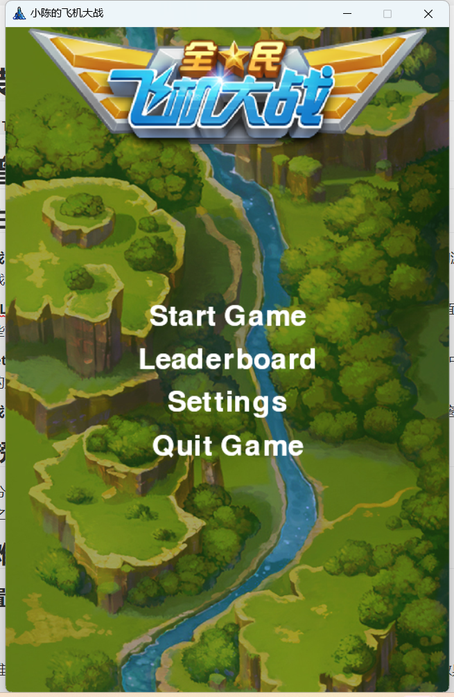
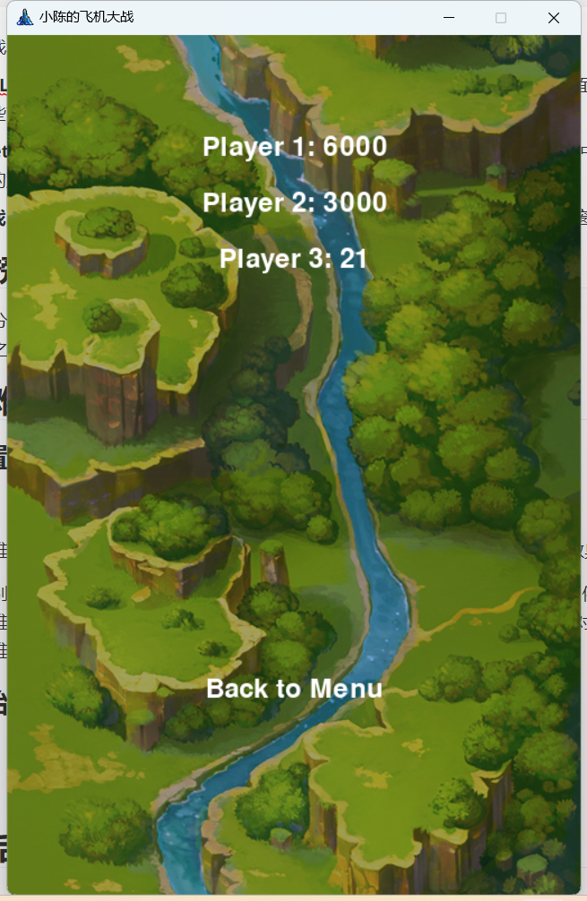
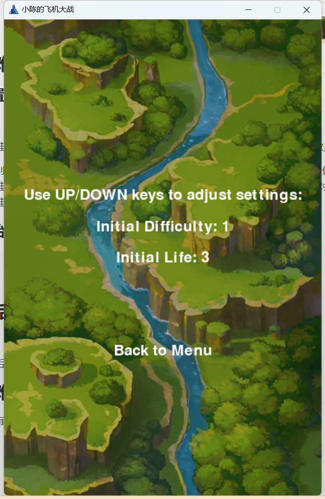
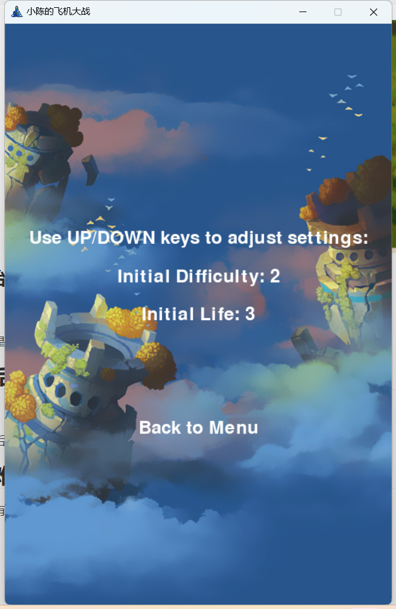

# 1.安装前提需求

`pip install pygame`

# 2.新增需求：

## 1新增主菜单：

1. **开始游戏 (Start Game)**: 当玩家点击"Start Game"按钮时，游戏会进入游戏主体的游玩状态（`PLAYING`），此时玩家可以控制飞机，与敌机战斗，并争取获得高分。
2. **排行榜 (Leaderboard)**: 当玩家点击"Leaderboard"按钮时，游戏会显示排行榜界面。排行榜显示了前三名玩家的最高分，玩家可以查看这些高分记录。
3. **设置 (Settings)**: 当玩家点击"Settings"按钮时，游戏会进入设置界面。在设置界面中，玩家可以调整游戏的初始难度和生命值，以更改游戏的难度级别和初始生命值。
4. **退出游戏 (Quit Game)**: 当玩家点击"Quit Game"按钮时，游戏会退出并关闭游戏窗口。

## 2.排名榜

添加一个计分系统，让玩家在游戏中获得分数。在游戏结束时显示玩家的得分，
并将得分与之前的分进行比较，在高分榜，显示前3名玩家的最高分。

## 3.设置难度功能

### 可以设置初始难度

难度默认是1

设置了不同难度级别（从1到5），每个级别都有不同的效果。以下是不同难度级别的效果说明：

随着难度级别的提高，敌机的数量和速度都会增加，这使得游戏变得更加具有挑战性。例如，在难度级别1，敌机较少且速度较慢，容易击败，但在难度级别5，敌机数量众多且速度非常快，需要更高的技巧和反应速度来应对。这样玩家可以根据自己的技能水平和挑战偏好选择不同的难度级别，增加游戏的乐趣和可玩性。

### 设置初始生命life_num

从1~5

生命值默认是3

## 4.失败后允许重新启动游戏

原本程序中，失败后无法关闭且无法重启游戏

新增了结束后的选择功能

## 5.根据难度自动匹配地图功能

不同难度拥有不同的地图场景

